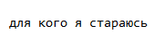

<!DOCTYPE html>
<html lang="ru">
<head>
    <meta charset="UTF-8">
    <meta name="viewport" content="width=device-width, initial-scale=1.0">
    <title>Zoffrikk — реклама в центре</title>
    
</head>
<body>

    

        

            
            SYSTEM LIVE
        

        
00:00:00

    

    <header>
        <h1>Zoffrikk</h1>
        
рекламное пространство

    </header>

 <!---------------------------------------------------------------------------------------------------------------->

    <!-- Два слота рядом -->
    

        <!-- Слот 1: фото -->
        

            
        

        <!-- Слот 2: локальное видео mp4 -->
        <!-- Загрузите файл video.mp4 в корень репозитория рядом с index.html -->
        

            <video class="ad-video" autoplay muted loop playsinline>
                <source src="5.mp4" type="video/mp4">
                Ваш браузер не поддерживает видео.
            </video>
        

    

    <!-- Модальное окно для фото -->
    

        
[ ЗАКРЫТЬ ✕ ]

        
    

    <!-- Модальное окно для видео -->
    

        
[ ЗАКРЫТЬ ✕ ]

        <video controls onclick="event.stopPropagation()">
            <source src="5.mp4" type="video/mp4">
            Ваш браузер не поддерживает видео.
        </video>
    

     <!-------------------------------------------------------------------------------------------------------------->

    <footer>
        
© ZOFFRIKK 2026

        

            
        

        

            <a href="https://t.me/anonaskbot?start=CgcCzK0SmqALCVS" target="_blank">Связаться → @Ivanee_tg</a>
        

    </footer>

    

</body>
</html>
