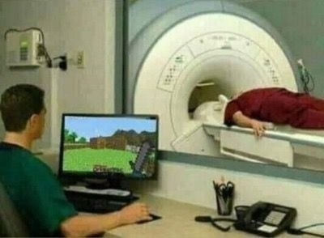

<!DOCTYPE html>
<html lang="ru">
<head>
    <meta charset="UTF-8">
    <meta name="viewport" content="width=device-width, initial-scale=1.0">
    <title>Zoffrikk — реклама в центре</title>
    
</head>
<body>

    

        

            
            SYSTEM LIVE
        

        
00:00:00

    

    

        <button class="nav-arrow prev" onclick="goPrev()">‹</button>

        

            <!-- Слайд 1: ФОТО (9 обычных + 1 тестовый = 10) -->
            

                
[ ФОТО ]

                

                    
Занять слот

                    
Занять слот

                    
Занять слот

                    
Занять слот

                    
Занять слот

                    
Занять слот

                    
Занять слот

                    
Занять слот

                    
Занять слот

                    <!-- ТЕСТОВЫЙ СЛОТ -->
                    
Тест

                

            

            <!-- Слайд 2: ВИДЕО (9 обычных + 1 тестовый = 10) -->
            

                
[ ВИДЕО ]

                

                    
<video class="ad-video" autoplay muted loop playsinline><source src="IMG_3985.MP4" type="video/mp4"></video>Занять слот

                    
<video class="ad-video" autoplay muted loop playsinline><source src="IMG_3985.MP4" type="video/mp4"></video>Занять слот

                    
<video class="ad-video" autoplay muted loop playsinline><source src="IMG_3985.MP4" type="video/mp4"></video>Занять слот

                    
<video class="ad-video" autoplay muted loop playsinline><source src="IMG_3985.MP4" type="video/mp4"></video>Занять слот

                    
<video class="ad-video" autoplay muted loop playsinline><source src="IMG_3985.MP4" type="video/mp4"></video>Занять слот

                    
<video class="ad-video" autoplay muted loop playsinline><source src="IMG_3985.MP4" type="video/mp4"></video>Занять слот

                    
<video class="ad-video" autoplay muted loop playsinline><source src="IMG_3985.MP4" type="video/mp4"></video>Занять слот

                    
<video class="ad-video" autoplay muted loop playsinline><source src="IMG_3985.MP4" type="video/mp4"></video>Занять слот

                    
<video class="ad-video" autoplay muted loop playsinline><source src="IMG_3985.MP4" type="video/mp4"></video>Занять слот

                    <!-- ТЕСТОВЫЙ СЛОТ -->
                    
<video class="ad-video" autoplay muted loop playsinline><source src="IMG_3985.MP4" type="video/mp4"></video>Тест

                

            

            <!-- Слайд 3: МУЗЫКА -->
            

                
[ МУЗЫКА ]

                

                    
СКОРО

                    
// музыкальный раздел в разработке //

                

            

        

        <button class="nav-arrow next" onclick="goNext()">›</button>
    

    

        <button class="dot-indicator active" onclick="goTo(0)"></button>
        <button class="dot-indicator" onclick="goTo(1)"></button>
        <button class="dot-indicator" onclick="goTo(2)"></button>
    

    <!-- Lightbox'ы: фото -->
    

[ ЗАКРЫТЬ ✕ ]

    

[ ЗАКРЫТЬ ✕ ]

    

[ ЗАКРЫТЬ ✕ ]

    

[ ЗАКРЫТЬ ✕ ]

    

[ ЗАКРЫТЬ ✕ ]

    

[ ЗАКРЫТЬ ✕ ]

    

[ ЗАКРЫТЬ ✕ ]

    

[ ЗАКРЫТЬ ✕ ]

    

[ ЗАКРЫТЬ ✕ ]

    

[ ЗАКРЫТЬ ✕ ]

    <!-- Lightbox'ы: видео -->
    

[ ЗАКРЫТЬ ✕ ]
<video controls onclick="event.stopPropagation()"><source src="IMG_3985.MP4" type="video/mp4"></video>

    

[ ЗАКРЫТЬ ✕ ]
<video controls onclick="event.stopPropagation()"><source src="IMG_3985.MP4" type="video/mp4"></video>

    

[ ЗАКРЫТЬ ✕ ]
<video controls onclick="event.stopPropagation()"><source src="IMG_3985.MP4" type="video/mp4"></video>

    

[ ЗАКРЫТЬ ✕ ]
<video controls onclick="event.stopPropagation()"><source src="IMG_3985.MP4" type="video/mp4"></video>

    

[ ЗАКРЫТЬ ✕ ]
<video controls onclick="event.stopPropagation()"><source src="IMG_3985.MP4" type="video/mp4"></video>

    

[ ЗАКРЫТЬ ✕ ]
<video controls onclick="event.stopPropagation()"><source src="IMG_3985.MP4" type="video/mp4"></video>

    

[ ЗАКРЫТЬ ✕ ]
<video controls onclick="event.stopPropagation()"><source src="IMG_3985.MP4" type="video/mp4"></video>

    

[ ЗАКРЫТЬ ✕ ]
<video controls onclick="event.stopPropagation()"><source src="IMG_3985.MP4" type="video/mp4"></video>

    

[ ЗАКРЫТЬ ✕ ]
<video controls onclick="event.stopPropagation()"><source src="IMG_3985.MP4" type="video/mp4"></video>

    

[ ЗАКРЫТЬ ✕ ]
<video controls onclick="event.stopPropagation()"><source src="IMG_3985.MP4" type="video/mp4"></video>

    <footer>
        
© ZOFFRIKK 2026

        

            
        

        

            <a href="https://t.me/anonaskbot?start=CgcCzK0SmqALCVS" target="_blank">Связаться → @Ivanee_tg</a>
        

    </footer>

    

</body>
</html>
